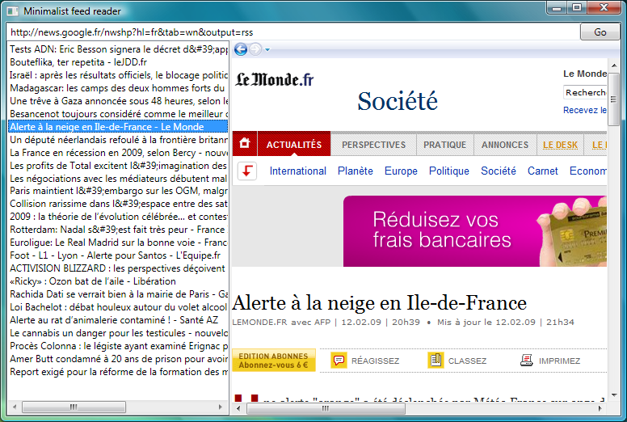

Aujourd'hui, je suis tombé par hasard sur une petite classe bien pratique : [SyndicationFeed](http://msdn.microsoft.com/en-us/library/system.servicemodel.syndication.syndicationfeed.aspx). Cette classe, apparue dans le framework 3.5, permet de manipuler des flux de syndication (comme RSS 2.0 ou Atom 1.0) avec un minimum de code. On peut l'utiliser pour créer et diffuser des flux, ou pour lire des flux existants.  Par exemple, voilà comment récupérer le fil d'actualité de Google News et afficher son titre, son lien d'origine et les titres de ses articles :  
```csharp
string url = "http://news.google.fr/nwshp?hl=fr&tab=wn&output=rss";
using (XmlReader reader = XmlReader.Create(url))
{
    SyndicationFeed feed = SyndicationFeed.Load(reader);
    Console.WriteLine(feed.Title.Text);
    Console.WriteLine(feed.Links[0].Uri);
    foreach(SyndicationItem item in feed.Items)
    {
        Console.WriteLine(item.Title.Text);
    }
}
```
  Simple, non ? :)  Tirons maintenant parti des facilités de binding de WPF pour créer un petit lecteur RSS graphique :  
```xml
<Window x:Class="TestFeeds.Window1"
        xmlns="http://schemas.microsoft.com/winfx/2006/xaml/presentation"
        xmlns:x="http://schemas.microsoft.com/winfx/2006/xaml"
        Title="Minimalist feed reader" Height="286" Width="531">
    <Grid>
        <Grid.RowDefinitions>
            <RowDefinition Height="Auto"/>
            <RowDefinition Height="*"/>
        </Grid.RowDefinitions>
        <DockPanel Grid.Row="0">
            <Button Name="btnGo"
                    DockPanel.Dock="Right"
                    Width="50"
                    Content="Go"
                    Click="btnGo_Click" />
            <TextBox Name="txtUrl" />
        </DockPanel>
        <Grid Grid.Row="1">
            <Grid.ColumnDefinitions>
                <ColumnDefinition Width="250"/>
                <ColumnDefinition Width="Auto"/>
                <ColumnDefinition Width="*"/>
            </Grid.ColumnDefinitions>
            <ListBox Name="lstFeedItems"
                     Grid.Column="0"
                     DisplayMemberPath="Title.Text" />
            <GridSplitter Grid.Column="1"
                          VerticalAlignment="Stretch"
                          Width="3"
                          ResizeBehavior="PreviousAndNext"
                          ResizeDirection="Columns"/>
            <Frame Name="frmContents"
                   Source="{Binding SelectedItem.Links[0].Uri, ElementName=lstFeedItems}"
                   Grid.Column="2"
                   NavigationUIVisibility="Visible">
            </Frame>
        </Grid>
    </Grid>
</Window>
```
  Le code-behind :  
```csharp
    private void btnGo_Click(object sender, RoutedEventArgs e)
    {
        using (XmlReader reader = XmlReader.Create(txtUrl.Text))
        {
            SyndicationFeed feed = SyndicationFeed.Load(reader);
            lstFeedItems.ItemsSource = feed.Items;
        }
    }
```
  Et voilà le résultat !  

