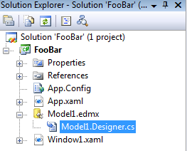
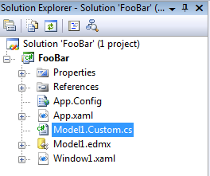
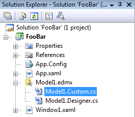

Vous avez certainement remarqué que, dans un projet C#, certains éléments sont placés sous un élément parent : c'est le cas, par exemple, pour les fichiers générés par un designer ou assistant :   L'astuce suivante permet d'obtenir le même comportement pour vos propres fichiers.  Supposons que vous souhaitiez personnaliser les classes générées par le designer d'entités. Vous ne pouvez pas modifier le fichier *Model1.Designer.cs*, puisque vos modifications seraient écrasées par le designer. Vous allez donc créer un nouveau fichier, par exemple *Model1.Custom.cs*, où vous allez mettre votre code pour les classes d'entité (à l'aide du mot clé *partial*). Par défaut, ce fichier est placé directement à la racine du projet :   Pour bien mettre en évidence le lien avec *Model1.edmx*, on préfèrerait le voir "sous" *Model1.edmx*... Bien que l'interface de Visual Studio ne propose pas cette option, c'est possible : il faut pour celà modifier le fichier *.csproj* à la main. Le plus simple, pour celà, est de décharger le projet (clic droit sur le projet, "*décharger le projet*") et de l'éditer directement dans Visual Studio (clic droit sur le projet déchargé, "*modifier FooBar.csproj*"). Cherchez l'élément  correspondant au fichier *Model1.Custom.cs*, et ajoutez un sous-élément  comme indiqué ci-dessous :  
```xml
    <Compile Include="Model1.Custom.cs">
        <DependentUpon>Model1.edmx</DependentUpon>
    </Compile>
```
  Rechargez le projet : *Model1.Custom.cs* apparait maintenant sous *Model1.edmx*.   Cette astuce permet de mieux structurer son projet pour s'y retrouver plus facilement.

