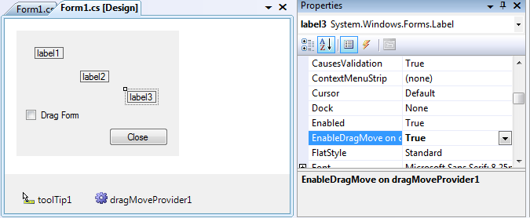

Je ressors de mes tiroirs un code que j'avais écrit il y a quelque temps, et dont je voudrais vous faire profiter...  Il existe en WPF une méthode très pratique pour déplacer une fenêtre sans bordure : `Window.DragMove`. Elle s'utilise comme ceci :  
```csharp
        private void Window_MouseDown(object sender, MouseButtonEventArgs e)
        {
            this.DragMove();
        }
```
  A partir de l'appel de cette méthode, la fenêtre est déplacée avec la souris jusqu'à ce que le bouton soit relâché. Difficile de faire plus simple ;)  Malheureusement, cette méthode n'existe qu'en WPF, et une majorité de développeurs travaillent encore avec Windows Forms. Je vous propose donc un code qui permet d'utiliser en Windows Forms la technique décrite ci-dessus, en y apportant les améliorations suivantes : 
- Utilisable sur n'importe quel contrôle, pas seulement sur une fenêtre
- Pas d'obligation de gérer l'évènement `MouseDown`
- Intégration au designer par un `IExtenderProvider`

Ma solution se compose des 2 éléments suivants :
- une classe statique `DragMoveExtensions` qui fournit des méthodes d'extensions pour la classe `Control` (facilement transformables en simples méthodes statiques pour l'utilisation en C# 2)
- un composant `DragMoveProvider`, qui implémente `IExtenderProvider` pour ajouter une propriété `EnableDragMove` aux contrôles de la Form

Pour l'utiliser, il y en a pour tous les goûts ;)
- La méthode la plus simple, sans écrire une seule ligne de code : en mode design, poser un `DragMoveProvider` sur la Form, et positionner à `true` la propriété `EnableDragMove` sur la Form ou le contrôle
- La méthode la plus proche de WPF : dans le handler de l'évènement `MouseDown`, appeler la méthode d'extension `DragMove` sur la Form ou le contrôle à déplacer

```csharp
        private void label2_MouseDown(object sender, MouseEventArgs e)
        {
            label2.DragMove();
        }
```
- La méthode la plus souple : appeler, au cas par cas, la méthode d'extension `EnableDragMove` sur la Form ou le contrôle à déplacer (aucun évènement à gérer).

```csharp
        private void checkBox1_CheckedChanged(object sender, EventArgs e)
        {
            this.EnableDragMove(checkBox1.Checked);
        }
```

  La solution en pièce jointe contient la librairie réutilisable WinFormsDragMove, ainsi qu'un projet de test qui illustre les différentes manières d'utiliser cette librairie. Une version compatible C# 2 des ces projets est également inclue.  [Télécharger les sources](http://www.thomaslevesque.fr/files/2012/06/DragMove.zip)

