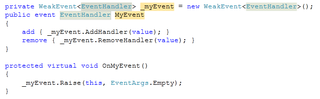

Comme vous le savez peut-être, la mauvaise utilisation des évènements est l'une des principales causes de fuites mémoires dans une application .NET : en effet, un évènement garde des références aux objets qui y sont abonnés (via le delegate), ce qui empêche le garbage collector de collecter ces objets quand ils ne sont plus utilisés. Le problème est particulièrement vrai pour un évènement statique, puisque les références sont conservées pendant toute l'exécution de l'application. Si on crée de nombreux objets qui s'abonnent à un évènement statique et qu'on ne les désabonne pas, ils restent indéfiniment en mémoire, même si on n'en a plus besoin depuis longtemps, ce qui peut finir par saturer la mémoire.  La solution "évidente" au problème est bien sûr de désabonner les objets qui ne sont plus utilisés. Malheureusement, il n'y a pas toujours de moyen simple de savoir à quel moment on peut désabonner un objet. Une autre approche est d'implémenter le pattern [WeakEvent](http://msdn.microsoft.com/en-us/library/aa970850.aspx), qui permet de ne garder qu'une référence faible vers les objets abonnés à l'évènement, de façon à ne pas empêcher le garbage collector de les collecter. Microsoft inclut dans WPF des éléments pour implémenter le pattern WeakEvent, et explique comment créer ses propres évènements selon ce pattern, à l'aide de la classe `WeakEventManager` et de l'interface `IWeakEventListener`. Cependant, cette technique est assez lourde à mettre en œuvre, aussi bien pour exposer un tel évènement (il faut créer une nouvelle classe dédiée) que pour s'abonner à l'évènement (implémentation de `IWeakEventListener`).  J'ai donc réfléchi à une autre solution, permettant d'implémenter plus facilement le pattern WeakEvent. Ma première idée était d'utiliser une liste de `WeakReference` pour stocker la liste des delegates abonnés à l'évènement. Malheureusement, lorsqu'on s'abonne à un évènement, on écrit généralement quelque chose comme ça :  
```csharp
myObject.MyEvent += new EventHandler(myObject_MyEvent);
```
  On crée donc un delegate, mais on ne garde aucune référence dessus. Puisque l'évènement ne référence ce delegate que via une WeakReference, rien n'empêche le garbage collector de le collecter... et c'est effectivement ce qui arrive. Au bout d'un temps variable (pas plus de quelques secondes d'après mes observations), le delegate est collecté et n'est donc plus appelé quand l'évènement est déclenché.  Plutôt que de conserver une référence faible vers le delegate lui même, une meilleure solution serait de faire une référence faible sur l'objet qui implémente la méthode (`Delegate.Target`). J'ai donc créé une classe `WeakDelegate<TDelegate>` pour gérer cela :  
```csharp
    public class WeakDelegate<TDelegate> : IEquatable<TDelegate>
    {
        private WeakReference _targetReference;
        private MethodInfo _method;

        public WeakDelegate(Delegate realDelegate)
        {
            if (realDelegate.Target != null)
                _targetReference = new WeakReference(realDelegate.Target);
            else
                _targetReference = null;
            _method = realDelegate.Method;
        }

        public TDelegate GetDelegate()
        {
            return (TDelegate)(object)GetDelegateInternal();
        }

        private Delegate GetDelegateInternal()
        {
            if (_targetReference != null)
            {
                return Delegate.CreateDelegate(typeof(TDelegate), _targetReference.Target, _method);
            }
            else
            {
                return Delegate.CreateDelegate(typeof(TDelegate), _method);
            }
        }

        public bool IsAlive
        {
            get { return _targetReference == null || _targetReference.IsAlive; }
        }


        #region IEquatable<TDelegate> Members

        public bool Equals(TDelegate other)
        {
            Delegate d = (Delegate)(object)other;
            return d != null
                && d.Target == _targetReference.Target
                && d.Method.Equals(_method);
        }

        #endregion

        internal void Invoke(params object[] args)
        {
            Delegate handler = (Delegate)(object)GetDelegateInternal();
            handler.DynamicInvoke(args);
        }
    }
```
  Il ne reste plus qu'à gérer une liste de `WeakDelegate<TDelegate>`, ce que fait la classe `WeakEvent<TDelegate>` :  
```csharp
    public class WeakEvent<TEventHandler>
    {
        private List<WeakDelegate<TEventHandler>> _handlers;

        public WeakEvent()
        {
            _handlers = new List<WeakDelegate<TEventHandler>>();
        }

        public virtual void AddHandler(TEventHandler handler)
        {
            Delegate d = (Delegate)(object)handler;
            _handlers.Add(new WeakDelegate<TEventHandler>(d));
        }

        public virtual void RemoveHandler(TEventHandler handler)
        {
            // also remove "dead" (garbage collected) handlers
            _handlers.RemoveAll(wd => !wd.IsAlive || wd.Equals(handler));
        }

        public virtual void Raise(object sender, EventArgs e)
        {
            var handlers = _handlers.ToArray();
            foreach (var weakDelegate in handlers)
            {
                if (weakDelegate.IsAlive)
                {
                    weakDelegate.Invoke(sender, e);
                }
                else
                {
                    _handlers.Remove(weakDelegate);
                }
            }
        }

        protected List<WeakDelegate<TEventHandler>> Handlers
        {
            get { return _handlers; }
        }
    }
```
  Cette classe gère automatiquement la suppression des handlers "morts" (collectés), et fournit une méthode `Raise` pour faciliter le déclenchement de l'évènement. Elle peut s'utiliser de la façon suivante :  
```csharp
        private WeakEvent<EventHandler> _myEvent = new WeakEvent<EventHandler>();
        public event EventHandler MyEvent
        {
            add { _myEvent.AddHandler(value); }
            remove { _myEvent.RemoveHandler(value); }
        }

        protected virtual void OnMyEvent()
        {
            _myEvent.Raise(this, EventArgs.Empty);
        }
```
  C'est un peu plus long à écrire qu'un évènement "classique", mais ce n'est finalement pas grand chose par rapport aux avantages que ça apporte... D'ailleurs, on peut facilement créer un "code snippet" pour Visual Studio, qui permet de créer un "évènement faible" en un rien de temps, avec seulement 3 informations à renseigner :  
```xml
<?xml version="1.0" encoding="utf-8" ?>
<CodeSnippets  xmlns="http://schemas.microsoft.com/VisualStudio/2005/CodeSnippet">
  <CodeSnippet Format="1.0.0">
    <Header>
      <Title>wevt</Title>
      <Shortcut>wevt</Shortcut>
      <Description>Code snippet for a weak event</Description>
      <Author>Thomas Levesque</Author>
      <SnippetTypes>
        <SnippetType>Expansion</SnippetType>
      </SnippetTypes>
    </Header>
    <Snippet>
      <Declarations>
        <Literal>
          <ID>type</ID>
          <ToolTip>Event type</ToolTip>
          <Default>EventHandler</Default>
        </Literal>
        <Literal>
          <ID>event</ID>
          <ToolTip>Event name</ToolTip>
          <Default>MyEvent</Default>
        </Literal>
        <Literal>
          <ID>field</ID>
          <ToolTip>Name of the field holding the registered handlers</ToolTip>
          <Default>_myEvent</Default>
        </Literal>
      </Declarations>
      <Code Language="csharp">
        <![CDATA[private WeakEvent<$type$> $field$ = new WeakEvent<EventHandler>();
        public event $type$ $event$
        {
            add { $field$.AddHandler(value); }
            remove { $field$.RemoveHandler(value); }
        }

        protected virtual void On$event$()
        {
            $field$.Raise(this, EventArgs.Empty);
        }$end$]]>
      </Code>
    </Snippet>
  </CodeSnippet>
</CodeSnippets>
```
  Ce qui donne dans Visual Studio le résultat suivant :  

