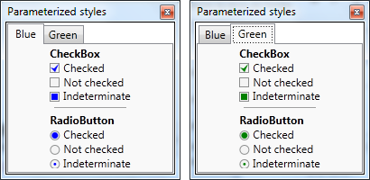

Je voudrais aujourd'hui partager avec vous une petite astuce que j'utilise souvent depuis quelques mois. Supposons que pour améliorer l'apparence de votre application, vous ayez créé des styles personnalisés pour les contrôles standards :    Bon, je ne suis pas designer, hein... mais ça fera parfaitement l'affaire pour illustrer mon propos ;). Ces styles sont très simples, ce sont les styles par défaut des `CheckBox` et `RadioButton` dans lesquels j'ai seulement modifié les templates pour remplacer les `BulletChrome` par ces superbes marques bleues. Voilà le code :  
```xml
        <Style x:Key="{x:Type CheckBox}" TargetType="{x:Type CheckBox}">
            <Setter Property="Foreground" Value="{DynamicResource {x:Static SystemColors.ControlTextBrushKey}}"/>
            <Setter Property="Background" Value="{StaticResource CheckBoxFillNormal}"/>
            <Setter Property="BorderBrush" Value="{StaticResource CheckBoxStroke}"/>
            <Setter Property="BorderThickness" Value="1"/>
            <Setter Property="FocusVisualStyle" Value="{StaticResource EmptyCheckBoxFocusVisual}"/>
            <Setter Property="Template">
                <Setter.Value>
                    <ControlTemplate TargetType="{x:Type CheckBox}">
                        <BulletDecorator Background="Transparent"
                                         SnapsToDevicePixels="true">
                            <BulletDecorator.Bullet>
                                <Border BorderBrush="{TemplateBinding BorderBrush}"
                                        Background="{TemplateBinding Background}"
                                        BorderThickness="1"
                                        Width="11" Height="11" Margin="0,1,0,0">
                                    <Grid>
                                        <Path Name="TickMark"
                                              Fill="Blue"
                                              Data="M0,4 5,9 9,0 4,5"
                                              Visibility="Hidden" />
                                        <Rectangle Name="IndeterminateMark"
                                                   Fill="Blue"
                                                   Width="7" Height="7"
                                                   HorizontalAlignment="Center"
                                                   VerticalAlignment="Center"
                                                   Visibility="Hidden" />
                                    </Grid>
                                </Border>
                            </BulletDecorator.Bullet>
                            <ContentPresenter HorizontalAlignment="{TemplateBinding HorizontalContentAlignment}"
                                              Margin="{TemplateBinding Padding}"
                                              RecognizesAccessKey="True"
                                              SnapsToDevicePixels="{TemplateBinding SnapsToDevicePixels}"
                                              VerticalAlignment="{TemplateBinding VerticalContentAlignment}"/>
                        </BulletDecorator>
                        <ControlTemplate.Triggers>
                            <Trigger Property="HasContent" Value="true">
                                <Setter Property="FocusVisualStyle" Value="{StaticResource CheckRadioFocusVisual}"/>
                                <Setter Property="Padding" Value="4,0,0,0"/>
                            </Trigger>
                            <Trigger Property="IsEnabled" Value="false">
                                <Setter Property="Foreground" Value="{DynamicResource {x:Static SystemColors.GrayTextBrushKey}}"/>
                            </Trigger>
                            <Trigger Property="IsChecked" Value="True">
                                <Setter TargetName="TickMark" Property="Visibility" Value="Visible" />
                            </Trigger>
                            <Trigger Property="IsChecked" Value="{x:Null}">
                                <Setter TargetName="IndeterminateMark" Property="Visibility" Value="Visible" />
                            </Trigger>
                        </ControlTemplate.Triggers>
                    </ControlTemplate>
                </Setter.Value>
            </Setter>
        </Style>
        <Style x:Key="{x:Type RadioButton}" TargetType="{x:Type RadioButton}">
            <Setter Property="Foreground" Value="{DynamicResource {x:Static SystemColors.ControlTextBrushKey}}"/>
            <Setter Property="Background" Value="#F4F4F4"/>
            <Setter Property="BorderBrush" Value="{StaticResource CheckBoxStroke}"/>
            <Setter Property="BorderThickness" Value="1"/>
            <Setter Property="Template">
                <Setter.Value>
                    <ControlTemplate TargetType="{x:Type RadioButton}">
                        <BulletDecorator Background="Transparent">
                            <BulletDecorator.Bullet>
                                <Grid VerticalAlignment="Center" Margin="0,1,0,0">
                                    <Ellipse Width="11" Height="11"
                                             Stroke="{TemplateBinding BorderBrush}"
                                             StrokeThickness="1"
                                             Fill="{TemplateBinding Background}" />
                                    <Ellipse Name="TickMark"
                                             Width="7" Height="7"
                                             Fill="Blue"
                                             Visibility="Hidden" />
                                    <Ellipse Name="IndeterminateMark"
                                             Width="3" Height="3"
                                             Fill="Blue"
                                             Visibility="Hidden" />
                                </Grid>
                            </BulletDecorator.Bullet>
                            <ContentPresenter HorizontalAlignment="{TemplateBinding HorizontalContentAlignment}"
                                              Margin="{TemplateBinding Padding}"
                                              RecognizesAccessKey="True"
                                              VerticalAlignment="{TemplateBinding VerticalContentAlignment}"/>
                        </BulletDecorator>
                        <ControlTemplate.Triggers>
                            <Trigger Property="HasContent" Value="true">
                                <Setter Property="FocusVisualStyle" Value="{StaticResource CheckRadioFocusVisual}"/>
                                <Setter Property="Padding" Value="4,0,0,0"/>
                            </Trigger>
                            <Trigger Property="IsEnabled" Value="false">
                                <Setter Property="Foreground" Value="{DynamicResource {x:Static SystemColors.GrayTextBrushKey}}"/>
                            </Trigger>
                            <Trigger Property="IsChecked" Value="True">
                                <Setter TargetName="TickMark" Property="Visibility" Value="Visible" />
                            </Trigger>
                            <Trigger Property="IsChecked" Value="{x:Null}">
                                <Setter TargetName="IndeterminateMark" Property="Visibility" Value="Visible" />
                            </Trigger>
                        </ControlTemplate.Triggers>
                    </ControlTemplate>
                </Setter.Value>
            </Setter>
        </Style>
```
  Vous avez donc maintenant de magnifiques contrôles qui vont faire de l'application un grand succès, le management est content, tout va pour le mieux dans le meilleur des mondes... Et là, vous réalisez que dans un autre écran de l'application, les contrôles doivent avoir le même style, mais en vert !  La première solution qui vient à l'esprit est de dupliquer le style en mettant du vert à la place du bleu. Mais comme vous êtes un bon développeur soucieux des bonnes pratiques, vous savez que la duplication de code, c'est mal : si vous devez un jour modifier le style de la `CheckBox` bleue, il faudra aussi modifier celui de la verte... et peut-être aussi la rouge, la noire, etc. Bref, ça deviendrait vite ingérable. Il faut donc refactoriser, mais comment ? Il faudrait pouvoir passer la couleur en paramètre du style, mais un style n'est pas une méthode à laquelle on peut passer des paramètres...  Il faudrait donc avoir une propriété supplémentaire pour indiquer la couleur des "ticks", et se binder sur cette propriété dans le template. Une approche possible est de créer des contrôles personnalisés hérités de `CheckBox` et `RadioButton`, avec une propriété supplémentaire `TickBrush`... mais personnellement je n'aime pas beaucoup cette approche : je préfère éviter de créer de nouveaux contrôles quand on peut s'en sortir avec les contrôles standard.  En fait, il y a une solution plus simple : il suffit de créer une classe, qu'on appelle par exemple `ThemeProperties`, et de déclarer dedans une propriété attachée de type `Brush`:  
```csharp
    public static class ThemeProperties
    {
        public static Brush GetTickBrush(DependencyObject obj)
        {
            return (Brush)obj.GetValue(TickBrushProperty);
        }

        public static void SetTickBrush(DependencyObject obj, Brush value)
        {
            obj.SetValue(TickBrushProperty, value);
        }

        public static readonly DependencyProperty TickBrushProperty =
            DependencyProperty.RegisterAttached(
                "TickBrush",
                typeof(Brush),
                typeof(ThemeProperties),
                new FrameworkPropertyMetadata(Brushes.Black));
    }
```
  On modifie un peu nos templates pour remplacer la couleur en dur par un binding sur cette propriété :  
```xml
                                ...

                                <!-- CheckBox -->
                                        <Path Name="TickMark"
                                              Fill="{TemplateBinding my:ThemeProperties.TickBrush}"
                                              Data="M0,4 5,9 9,0 4,5"
                                              Visibility="Hidden" />
                                        <Rectangle Name="IndeterminateMark"
                                                   Fill="{TemplateBinding my:ThemeProperties.TickBrush}"
                                                   Width="7" Height="7"
                                                   HorizontalAlignment="Center"
                                                   VerticalAlignment="Center"
                                                   Visibility="Hidden" />

                                ...

                                <!-- RadioButton -->
                                    <Ellipse Name="TickMark"
                                             Width="7" Height="7"
                                             Fill="{TemplateBinding my:ThemeProperties.TickBrush}"
                                             Visibility="Hidden" />
                                    <Ellipse Name="IndeterminateMark"
                                             Width="3" Height="3"
                                             Fill="{TemplateBinding my:ThemeProperties.TickBrush}"
                                             Visibility="Hidden" />
```
  Et quand on utilise les contrôles, on précise la couleur qu'on veut pour le tick :  
```xml
<CheckBox Content="Checked" IsChecked="True" my:ThemeProperties.TickBrush="Blue" />
```
  On peut donc maintenant avoir des contrôles qui partagent le même style, mais en changeant la couleur d'un élément du template :    On a donc effectivement rendu les styles paramétrables ! Il reste cependant un petit souci : étant donné que tous les contrôles d'un même éran utilisent tous la même couleur, il n'est pas très pratique de devoir la répéter sur chaque contrôle. L'idéal serait de pouvoir indiquer à la racine de la vue la couleur à utiliser pour tous les contrôles... et justement, les dependency properties (et donc les propriétés attachées) offrent une fonctionnalité qui permet de faire exactement ça : l'héritage de valeur. Il suffit d'indiquer le flag `Inherits` lors de la déclaration de la propriété `TickBrush` :  
```csharp
        public static readonly DependencyProperty TickBrushProperty =
            DependencyProperty.RegisterAttached(
                "TickBrush",
                typeof(Brush),
                typeof(ThemeProperties),
                new FrameworkPropertyMetadata(Brushes.Black, FrameworkPropertyMetadataOptions.Inherits));
```
  Avec cette modification, la propriété devient "ambiante" : il suffit d'indiquer sa valeur sur un contrôle parent (par exemple la racine de la vue) pour que tous les descendants prennent en compte cette valeur. On peut donc très facilement faire des écrans avec des contrôles qui partagent le même style, mais en appliquant des couleurs différentes.  Le concept peut bien sûr être étendu à d'autres cas : en fait, dès qu'un élément du template doit varier selon un critère arbitraire, cette technique peut s'appliquer. Cela évite bien souvent de devoir dupliquer le template pour ne changer qu'un petit détail.

