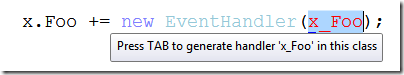
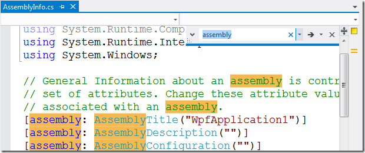
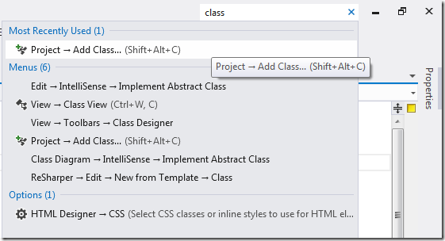
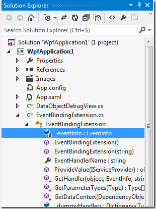

Visual Studio 2012 RC est sorti il y a 10 jours, et bien que je n’ai pas encore eu beaucoup de temps pour jouer avec, j’en suis assez satisfait pour l’instant. Beaucoup de choses ont déjà été dites sur le design, ainsi que sur les nouvelles fonctionnalités les plus importantes, mais il y a aussi beaucoup de petites améliorations moins remarquables qui vont nous faciliter la vie. Comme je n’ai pas vu grand chose d’écrit à ce sujet, je me suis dit qu’il serait utile de faire une petite liste de ce que j’ai remarqué jusqu’ici.

### Amélioration de *Modifier et Continuer*: meilleure expérience de débogage avec les méthodes anonymes

*Modifier et continuer* est une fonctionnalité très utile qui est disponible dans Visual Studio depuis longtemps. C’est génial quand vous devez corriger du code en plein milieu d’une session de débogage pas-à-pas, sans avoir à redémarrer toute l’application. Cette fonctionnalité a toujours eu une limitation : elle n’était pas utilisable dans une méthode contenant une méthode anonyme ou une expression lambda, comme indiqué par ce message d’erreur :

> Modifying a ’method’ which contains a lambda expression will prevent the debug session from continuing while Edit and Continue is enabled.

Avant .NET 3.5, ce n’était pas vraiment un problème car les méthodes anonymes n’étaient pas très courantes, mais depuis l’arrivée de Linq et la généralisation des expressions lambda, cette limitation était devenue de plus en plus gênante.

Eh bien, bonne nouvelle : Visual Studio 2012 règle ça ! Vous pouvez maintenant utiliser *Modifier et Continuer* dans une méthode qui contient des expressions lambda ou des requêtes Linq. Notez que la limitation n’a pas complètement disparu : il n’est toujours pas possible de modifier une *instruction* qui contient une méthode anonyme. Notez le message légèrement différent :

> Modifying a statement which contains a lambda expression will prevent the debug session from continuing while Edit and Continue is enabled.

Mais vous pouvez modifier tout le reste du corps de la méthode, ce qui est une grosse amélioration. Notez que la modification d’une méthode qui contient des types anonymes est également supportée, tant que vous ne modifiez pas le type anonyme lui-même.

### Optimisation de l’auto-complétion pour les gestionnaires d’évènements.

Visual Studio a une fonctionnalité d’auto-complétion très utile qui permet de générer un gestionnaire d’évènement automatiquement quand vous tapez `+=` et <kbd>Tab</kbd> après un nom d’évènement :

Mais la partie `new EventHandler(…)` est redondante, car depuis C# 2, un groupe de méthode est implicitement convertible en un delegate de type compatible. Visual Studio 2012 corrige cela et génère la forme courte :

OK, c’est un tout petit changement, mais l’ancien comportement m’agaçait beaucoup… J’avais d’ailleurs [suggéré cette amélioration sur Connect](http://connect.microsoft.com/VisualStudio/feedback/details/632300/auto-generated-event-handlers-should-use-implicit-conversion-of-method-group-to-delegate), donc je suis content de voir qu’elle a été implémentée.

### Amélioration de *Rechercher/Remplacer*

Le dialogue de recherche de Visual Studio n’avait reçu aucune amélioration depuis une éternité (probablement depuis VS2003 ou VS2005), il était donc temps que ça change… Dans VS2012, il a été remplacé par la fonction *Quick Find* de l’extension [Productivity Power Tools](http://visualstudiogallery.msdn.microsoft.com/d0d33361-18e2-46c0-8ff2-4adea1e34fef). Cela se présente sous forme d’un petit panneau dans le coin en haut à droite de l’éditeur, beaucoup plus discret que l’ancien dialogue :

Ce panneau offre les fonctionnalités suivantes :

- recherche incrémentale (les correspondances sont surlignées au fur et à mesure que vous tapez votre recherche)
- accès rapide aux options telles que Respecter la casse, Mot entier ou Expression régulière, via la liste déroulante du champ de recherche
- support des expressions régulières .NET (l’ancien dialogue de recherche utilisait un autre type de regex, pas totalement compatible avec la syntaxe des regex .NET)

Si, pour une raison ou une autre, vous voulez utiliser le dialogue de recherche complet, il est toujours là : un élément du menu déroulant du champ de recherche permet d’y accéder.

### Lancement rapide

> Où est cette commande déjà ? Dans le menu Déboguer ou dans le menu Projet ? Je n’arrive pas à m’en souvenir, et je ne connais pas le raccourci clavier…

Cette réflexion vous est familière ? A moi, oui… Visual Studio a tellement de fonctionnalités qu’il est parfois difficile de trouver ce que vous cherchez. C’est pourquoi la fonctionnalité de *Lancement rapide* est une nouveauté appréciable; elle se présente sous forme d’une boite de recherche dans le coin en haut à droite de l’EDI, et vous permet de simplement taper ce que vous voulez faire :

Encore une fois, cette fonctionnalité vient de l’extension Productivity Power Tools, et a été incluse dans Visual Studio lui-même. Elle a aussi reçu une place plus en vue dans l’EDI (dans VS2010 elle était seulement accessible via le raccourci <kbd>Ctrl+Q</kbd>).

### Un explorateur de solution plus malin

Jusqu’à maintenant, l’explorateur de solution affichait seulement les fichiers qui se trouvaient dans votre projet, mais rien sur le contenu des fichiers. Si vous vouliez voir les classes et membres, il fallait basculer sur la vue des classes. Visual Studio 2012 change cela : vous pouvez maintenant voir ce qui est déclaré dans le fichier, en dépliant simplement le nœud correspondant dans l’explorateur de solution :

Cette fonctionnalité était présente dans Eclipse depuis longtemps, il était donc temps que Visual Studio rattrape ce retard .

Quelques autres fonctionnalités intéressantes du nouvel explorateur de solution :

- *Scope to This* : permet de voir seulement l’arborescence à partir d’un nœud spécifique (par exemple si vous voulez voir seulement le contenu d’un dossier). La nouvelle arborescence peut être ouverte dans une vue séparée.
- *Pending changes filter* : permet d’afficher uniquement les fichiers modifiés (si le contrôle de source est actif pour le projet)
- *Open files filter* : permet de n’afficher que les fichiers actuellement ouverts
- *Sync With Active Document* : permet de localiser rapidement le fichier courant dans l’explorateur de solution (*très* utile pour les grosses solutions)

Une fois de plus, c’est une fonctionnalité qui vient de Productivity Power Tools (elle s’appelait *Solution Navigator*), avec quelques améliorations.

### MENUS EN LETTRES CAPITALES

Les titres des menus de VS2012 sont EN LETTRES CAPITALES, et ce n’est pas vraiment le changement le plus populaire… il y a eu une quantité impressionnante de retours négatifs à ce sujet! Franchement, je suis un peu surpris que les gens attachent autant d’importance à un détail si insignifiant, alors qu’il y a tant d’autres choses plus importantes à discuter. Personnellement, ça m’a un peu troublé quand j’ai vu les premières captures d’écran, mais quand j’ai pu mettre la main sur la RC, j’ai finalement trouvé que ça ne me gênait pas du tout. Je suppose que la plupart des gens finiront par s’y habituer…

Bref, la raison pour laquelle je mentionne ça, c’est simplement pour dire que si vraiment vous n’aimez pas les menus EN LETTRES CAPITALES, vous pouvez les remettre en casse normale avec une simple manipulation du registre. Ouvrez regedit, trouvez la clé `HKEY_CURRENT_USER\Software\Microsoft\VisualStudio\11.0\General`, créez une valeur DWORD nommée `SuppressUppercaseConversion`, et mettez sa valeur à 1.

