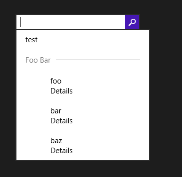
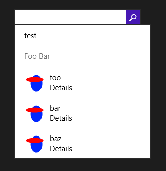

Aujourd’hui je me suis heurté à un bug bizarre qui m’a fait perdre une heure ou deux, donc je me suis dit que ça méritait d’écrire un billet à ce sujet au cas où quelqu’un d’autre rencontrerait le même problème.

Le contrôle [`SearchBox`](http://msdn.microsoft.com/library/windows/apps/dn252771) a été ajouté dans Windows 8.1 pour permettre des scénarios de recherche directement dans une application Windows Store. L’une de ses fonctionnalités est l’affichage de suggestions basées sur la saisie de l’utilisateur. Il y a trois sortes de suggestions :

- Les suggestions d’historique sont les requêtes précédemment effectuées par l’utilisateur. C’est géré automatiquement, donc vous n’avez aucun code à écrire pour que ça marche.
- Les suggestions de recherche permettent de proposer des termes de recherche en fonction de ce que l’utilisateur a déjà saisi ; si l’utilisateur en sélectionne une, le texte actuel de la recherche est remplacé par celui de la suggestion, et valider la requête lancera la recherche avec ce texte.
- Les suggestions de résultat sont des suggestions pour des résultats exacts. L’utilisateur peut directement choisir un de ces résultats sans lancer une recherche complète.


Pour fournir des suggestions, il faut gérer l’évènement [`SuggestionsRequested`](http://msdn.microsoft.com/en-us/library/windows/apps/windows.ui.xaml.controls.searchbox.suggestionsrequested) de la `SearchBox`, et ajouter des suggestions à l’aide des méthodes [`AppendQuerySuggestion`](http://msdn.microsoft.com/en-us/library/windows/apps/windows.applicationmodel.search.searchsuggestioncollection.appendquerysuggestion) et [`AppendResultSuggestion`](http://msdn.microsoft.com/en-us/library/windows/apps/hh700542). Concentrons-nous sur les suggestions de résultat.

La méthode `AppendResultSuggestion` prend plusieurs paramètres, dont l’un représente l’image à afficher pour la suggestion. Il est obligatoire (passer null lèvera une exception), et il est de type [`IRandomAccessStreamReference`](http://msdn.microsoft.com/en-us/library/windows/apps/windows.storage.streams.irandomaccessstreamreference), c’est-à-dire quelque chose qui peut fournir un flux. Je trouve ça un peu étrange, vu qu’il aurait été plus naturel de passer une `ImageSource`, mais c’est comme ça… J’ai donc cherché une classe qui implémente l’interface `IRandomAccessStreamReference`, et le premier candidat évident que j’ai trouvé était la classe `StorageFile`, qui représente un fichier. J’ai donc écrit le code suivant :

```
private async void SearchBox_SuggestionsRequested(SearchBox sender, SearchBoxSuggestionsRequestedEventArgs args)
{
    var deferral = args.Request.GetDeferral();
    try
    {
        var imageUri = new Uri("ms-appx:///test.png");
        var imageRef = await StorageFile.GetFileFromApplicationUriAsync(imageUri);
        args.Request.SearchSuggestionCollection.AppendQuerySuggestion("test");
        args.Request.SearchSuggestionCollection.AppendSearchSeparator("Foo Bar");
        args.Request.SearchSuggestionCollection.AppendResultSuggestion("foo", "Details", "foo", imageRef, "Result");
        args.Request.SearchSuggestionCollection.AppendResultSuggestion("bar", "Details", "bar", imageRef, "Result");
        args.Request.SearchSuggestionCollection.AppendResultSuggestion("baz", "Details", "baz", imageRef, "Result");
    }
    finally
    {
        deferral.Complete();
    }
}
```

Ce code s’exécute sans aucune erreur, et les suggestions sont affichées… mais l’image n’apparait pas !



J’ai passé un long moment à tout revérifier, à faire plein de petits changements pour essayer de trouver l’origine du problème, j’ai même fait ma propre implémentation de `IRandomAccessStreamReference`… en vain.

J’ai finalement [posté mon problème sur Stack Overflow](http://stackoverflow.com/questions/19769689/image-not-shown-for-result-suggestions-in-searchbox), et quelqu’un m’a gentiment fourni la solution, qui était très simple : au lieu d’utiliser `StorageFile`, il faut utiliser [`RandomAccessStreamReference`](http://msdn.microsoft.com/en-us/library/windows/apps/windows.storage.streams.randomaccessstreamreference) (ça semble assez évident une fois qu’on sait que ça existe). Le code devient donc :

```
private void SearchBox_SuggestionsRequested(SearchBox sender, SearchBoxSuggestionsRequestedEventArgs args)
{
    var imageUri = new Uri("ms-appx:///test.png");
    var imageRef = RandomAccessStreamReference.CreateFromUri(imageUri);
    args.Request.SearchSuggestionCollection.AppendQuerySuggestion("test");
    args.Request.SearchSuggestionCollection.AppendSearchSeparator("Foo Bar");
    args.Request.SearchSuggestionCollection.AppendResultSuggestion("foo", "Details", "foo", imageRef, "Result");
    args.Request.SearchSuggestionCollection.AppendResultSuggestion("bar", "Details", "bar", imageRef, "Result");
    args.Request.SearchSuggestionCollection.AppendResultSuggestion("baz", "Details", "baz", imageRef, "Result");
}
```

(Notez que la méthode n’est plus asynchrone, il n’y a donc plus besoin d’utiliser l’objet deferral).

Les suggestions sont maintenant affichées comme je le voulais, avec l’image :



La leçon à tirer de cette histoire est que, bien que le paramètre `image` soit de type `IRandomAccessStreamReference`, **il ne semble pas accepter autre chose qu’une instance de la classe `RandomAccessStreamReference`**. Si vous passez n’importe quelle autre implémentation de l’interface, cela échoue silencieusement et l’image n’est pas affichée. C’est clairement un bug : si le type déclaré du paramètre dans la signature de la méthode et une interface, la méthode devrait accepter n’importe quelle implémentation de cette interface ; sinon, la signature devrait déclarer le type concret. J’ai signalé le [bug](https://connect.microsoft.com/VisualStudio/feedback/details/807704/searchbox-windows-8-1-doesnt-show-the-image-if-it-is-not-an-instance-of-randomaccessstreamreference) sur Connect, avec un peu de chance ce sera corrigé dans une future version.

En espérant que ce soit utile à quelqu’un !

