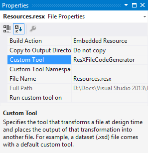

Aussi loin que je me souvienne, il y a toujours eu dans Visual Studio quelque chose appelé “outils personnalisés” (custom tools), également connus sous le nom de [*single-file generators*](http://msdn.microsoft.com/en-us/library/bb166817%28v=vs.110%29.aspx). Quand vous appliquez un tel outil à un fichier de votre projet, il génère quelque chose (généralement du code, mais pas forcément) en fonction du contenu du fichier. Par exemple, l’outil personnalisé par défaut pour les fichiers de ressource s’appelle ResXFileCodeGenerator, et génère une classe qui permet d’accéder facilement aux ressources définies dans le fichier resx.

Quand vous enregistrez un fichier qui a un outil personnalisé associé, Visual Studio réexécute automatiquement l’outil personnalisé pour regénérer sa sortie. Vous pouvez aussi le faire manuellement, en utilisant la commande “Exécuter l’outil personnalisé” depuis le menu contextuel du fichier dans l’explorateur de solution.

Habituellement, les outils personnalisés ne se basent que sur un fichier d’entrée pour générer leur sortie, mais parfois les choses sont un peu plus complexes. Par exemple, prenons les [templates T4](http://msdn.microsoft.com/en-us/library/vstudio/bb126445.aspx) : ils ont un outil personnalisé associé (TextTemplatingFileGenerator), donc cet outil est exécuté quand le template est sauvegardé, mais bien souvent, le template lui-même utilise d’autres fichiers d’entrée pour générer sa sortie. Donc l’outil personnalisé doit être exécuté non seulement quand le template est modifié, mais également quand les fichiers dont il dépend sont modifiés. Puisqu’il n’y a pas de moyen d’indiquer à Visual Studio l’existence de cette dépendance, il faut exécuter l’outil personnalisé manuellement, ce qui est assez agaçant…

Comme j’étais dans cette situation, et que j’en avais assez d’aller exécuter manuellement l’outil personnalisé sur mes templates T4, j’ai finalement créé une extension Visual Studio pour le faire automatiquement : [AutoRunCustomTool](http://visualstudiogallery.msdn.microsoft.com/ecb123bf-44bb-4ae3-91ee-a08fc1b9770e). Le nom manque un peu d’imagination, mais au moins il est descriptif…

Cet outil est conçu pour être très simple et discret : il fait son travail en silence, sans vous gêner, et vous oubliez très vite qu’il est là. Il ajoute une nouvelle propriété à chaque élément du projet : “Run custom tool on”. Cette propriété est une collection de noms de fichiers pour lesquels l’outil personnalisé doit être exécuté à chaque fois que cet élément de projet est enregistré. Par exemple, si vous avez un template T4 (*Template.tt*) qui génère un fichier (*Output.txt*) en fonction du contenu d’un autre fichier (*Input.txt*), il suffit d’ajouter “Template.tt” à la propriété “Run custom tool on” de *Input.txt*. A chaque fois que vous enregistrerez *Input.txt*, l’outil personnalisé sera exécuté automatiquement sur *Template.tt*, ce qui regénèrera le contenu de *Output.txt*. Vous trouverez un exemple concret sur [la page de l’outil dans la galerie Visual Studio](http://visualstudiogallery.msdn.microsoft.com/ecb123bf-44bb-4ae3-91ee-a08fc1b9770e).

J’ai créé AutoRunCustomTool il y a 6 mois environ, mais la version initiale n’était pas très bien dégrossie, donc je n’ai pas communiqué à son sujet. J’ai publié la deuxième version il y a quelques jours, et je pense qu’il est maintenant prêt à être utilisé par tout le monde. Si vous êtes intéressé par le code, vous pouvez le trouver [sur GitHub](https://github.com/thomaslevesque/AutoRunCustomTool), qui est aussi l’endroit où vous pouvez signaler les problèmes éventuels.

