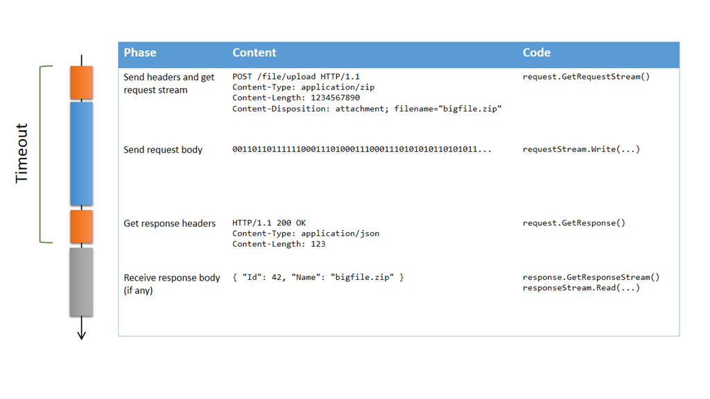
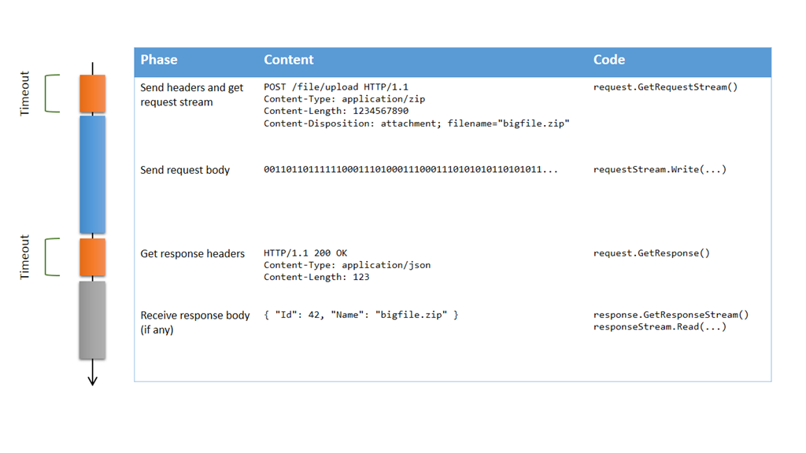

Si vous avez déjà eu à uploader de gros volumes de données en HTTP, vous avez probablement rencontré des problèmes de timeout. La valeur par défault de `Timeout` pour `HttpWebRequest` est de 100 secondes, ce qui signifie que s’il s’écoule plus que cette durée entre le moment où vous envoyez les en-têtes de la requête et celui où vous recevez les en-têtes de la réponse, votre requête échouera. Bien sûr, si vous uploadez un gros fichier, vous devez augmenter ce timeout… mais à quelle valeur ?

Si vous connaissez la bande passante disponible, vous pourriez calculer une approximation du temps nécessaire à l’upload, mais ce n’est pas très fiable, parce que si le réseau est encombré, cela prendra plus longtemps, et votre requête échouera alors qu’elle aurait pu réussir si elle avait eu plus de temps. Alors, faut-il définir le timeout à une valeur très grande, comme plusieurs heures, voire `Timeout.Infinite` ? Probablement pas. La principale raison est que même si le transfert proprement dit peut durer des heures, certaines phases de l’échange ne devraient pas durer si longtemps. Décomposons les phases d’un upload HTTP :



Obtenir le flux de la requête ou récupérer la réponse (parties oranges) n’est pas supposé prendre très longtemps, donc il est clair qu’on a besoin ici d’un timeout plutôt court (la valeur par défaut de 100 secondes semble raisonnable). Par contre, envoyer le corps de la requête (partie bleue) peut prendre beaucoup plus longtemps, et il n’y a pas de moyen fiable de déterminer combien de temps ça devrait prendre; tant qu’on arrive à envoyer des données et que le serveur les reçoit, il n’y a aucune raison de ne pas continuer, même si ça prend des heures. Donc en fait, on ne veut pas du tout de timeout dans ce cas ! Malheureusement, le comportement de la propriété `Timeout` est de tout prendre en compte de l’appel à `GetRequestStream` jusqu’au retour de `GetResponse`…

A mon avis, c’est un défaut de conception de la classe `HttpWebRequest`, et il me gêne depuis très longtemps. Donc j’ai fini par trouver une solution, qui se base sur le fait que les versions asynchrones de `GetRequestStream` et `GetResponse` n’ont pas de mécanisme de timeout. Voilà ce que dit la documentation :


> *La propriété Timeout n'a aucun effet sur les requêtes asynchrones lancées à l'aide des méthodes BeginGetResponse ou BeginGetRequestStream.*
> 
> *Dans le cas de requêtes asynchrones, l'application cliente implémente son propre mécanisme de délai d'expiration. Consultez l'exemple de la méthode BeginGetResponse.*


Une solution pourrait donc être d’utiliser ces méthodes directement (ou les nouvelles versions basées sur des `Task`: `GetRequestStreamAsync` et `GetResponseAsync`) ; mais bien souvent, il y déjà une base de code existante qui utilise les méthodes synchrones, et changer le code pour le rendre complètement asynchrone n’est généralement pas trivial. L’approche la plus simple est de créer des wrapper synchrones autour de `BeginGetRequestStream` et `BeginGetResponse`, avec un moyen de spécifier un timeout pour ces opérations :

```
    public static class WebRequestExtensions
    {
        public static Stream GetRequestStreamWithTimeout(
            this WebRequest request,
            int? millisecondsTimeout = null)
        {
            return AsyncToSyncWithTimeout(
                request.BeginGetRequestStream,
                request.EndGetRequestStream,
                millisecondsTimeout ?? request.Timeout);
        }

        public static WebResponse GetResponseWithTimeout(
            this HttpWebRequest request,
            int? millisecondsTimeout = null)
        {
            return AsyncToSyncWithTimeout(
                request.BeginGetResponse,
                request.EndGetResponse,
                millisecondsTimeout ?? request.Timeout);
        }

        private static T AsyncToSyncWithTimeout<T>(
            Func<AsyncCallback, object, IAsyncResult> begin,
            Func<IAsyncResult, T> end,
            int millisecondsTimeout)
        {
            var iar = begin(null, null);
            if (!iar.AsyncWaitHandle.WaitOne(millisecondsTimeout))
            {
                var ex = new TimeoutException();
                throw new WebException(ex.Message, ex, WebExceptionStatus.Timeout, null);
            }
            return end(iar);
        }
    }
```

(notez que j’ai utilisé les méthodes Begin/End plutôt que les méthodes Async, afin de garder la compatibilité avec des versions plus anciennes de  .NET)

Ces méthodes d’extension peuvent être utilisées à la place de `GetRequestStream` et `GetResponse` ; chacune d’elle déclenchera une exception de timeout si elle dure trop longtemps, mais une fois que vous avez le flux de la requête, vous avez tout le temps que vous voulez pour uploader les données. Notez que le flux lui-même a ses propres timeouts de lecture et d’écriture (5 minutes par défaut), donc si 5 minutes s’écoulent sans que le moindre octet soit uploadé, la méthode `Write` déclenchera une exception. Voilà le nouveau scénario d’upload en utilisant ces nouvelles méthodes :



Comme vous pouvez le voir, la seule différence est que le timeout ne s’applique plus au transfert du corps de la requête, mais seulement à l’obtention du flux de la requête et de la réponse. Voilà un exemple complet qui correspond au scénario ci-dessus :

```
long UploadFile(string path, string url, string contentType)
{
    // Build request
    var request = (HttpWebRequest)WebRequest.Create(url);
    request.Method = WebRequestMethods.Http.Post;
    request.AllowWriteStreamBuffering = false;
    request.ContentType = contentType;
    string fileName = Path.GetFileName(path);
    request.Headers["Content-Disposition"] = string.Format("attachment; filename=\"{0}\"", fileName);
    
    try
    {
        // Open source file
        using (var fileStream = File.OpenRead(path))
        {
            // Set content length based on source file length
            request.ContentLength = fileStream.Length;
            
            // Get the request stream with the default timeout
            using (var requestStream = request.GetRequestStreamWithTimeout())
            {
                // Upload the file with no timeout
                fileStream.CopyTo(requestStream);
            }
        }
        
        // Get response with the default timeout, and parse the response body
        using (var response = request.GetResponseWithTimeout())
        using (var responseStream = response.GetResponseStream())
        using (var reader = new StreamReader(responseStream))
        {
            string json = reader.ReadToEnd();
            var j = JObject.Parse(json);
            return j.Value<long>("Id");
        }
    }
    catch (WebException ex)
    {
        if (ex.Status == WebExceptionStatus.Timeout)
        {
            LogError(ex, "Timeout while uploading '{0}'", fileName);
        }
        else
        {
            LogError(ex, "Error while uploading '{0}'", fileName);
        }
        throw;
    }
}
```

J’espère que cela vous sera utile !

