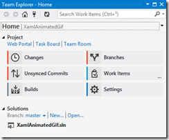
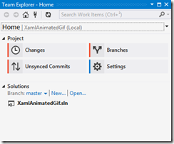

J’ai commencé récemment à utiliser Visual Studio Online pour des projets personnels, et je dois dire que c’est une très bonne plateforme, même si ce serait bien de pouvoir héberger des projets publics et non pas seulement privés. J’apprécie particulièrement l’intégration dans le Team Explorer de Visual Studio pour gérer les tâches et les builds.

Cependant j’ai remarqué un petit bug quand on utilise Git pour le contrôle de version : le remote pour VS Online **doit** s’appeler `origin`, sinon Team Explorer ne détecte pas qu’il s’agit d’un projet VS Online, et n’affiche pas les pages “Builds” et “Work Items”.



C’est clairement un bug (quoique mineur), car le nom `origin` est juste une convention, et un remote Git peut s’appeler n’importe comment ; je l’ai signalé [sur Connect](https://connect.microsoft.com/VisualStudio/feedback/details/998359/visual-studio-online-git-integration-in-team-explorer-doesnt-work-if-the-remote-for-vso-isnt-named-origin). Si vous rencontrez ce problème, vous pouvez le contourner en renommant le remote en `origin` :

```
git remote rename vso origin
```

