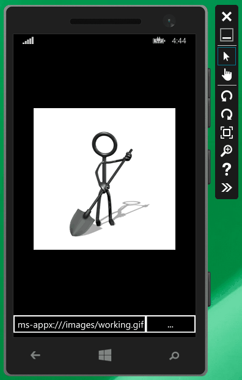

Il y a quelques années, j’avais écrit [un article](/2011/03/27/wpf-afficher-une-image-gif-animee/) qui montrait comment afficher un GIF animé en WPF. L’article incluait le code complet, et avait eu un certain succès, puisque WPF n’avait pas de support intégré pour les GIFs animés. Suite aux problèmes mentionnés dans les commentaires, j’ai apporté de nombreuses modifications au code dans l’article. Au bout d’un certain temps j’ai fini par trouver que ce n’était vraiment pas pratique, j’ai donc publié le code sur CodePlex (il a depuis déménagé vers GitHub) sous le nom [WpfAnimatedGif](https://github.com/thomaslevesque/WpfAnimatedGif), et j’ai commencé à le maintenir en tant que projet open-source. C’était mon premier projet open-source sérieux, et il a connu une certaine popularité.

Quand les signalement de bugs ont commencé à arriver, un problème sérieux a rapidement été mis en évidence : la bibliothèque consommait une *énorme* quantité de mémoire. Il y avait quelques fuites, que j’ai corrigées, mais au final le problème était inhérent au mode de fonctionnement de la librairie : elle préparait toutes les frames à l’avance, les gardait en mémoire, et les affichait chacune à leur tour à l’aide d’une animation WPF. Avoir toutes les frames pré-rendues en mémoire était raisonnable pour de petites images avec peu de frames, mais posait un vrai problème pour de grosses animations GIF avec de nombreuses frames.

Il aurait peut-être été possible de modifier le cœur de la bibliothèque pour utiliser une autre approche, mais il y avait d’autres problèmes auxquels je voulais m’attaquer. Par exemple, elle se reposait en grande partie sur les fonctionnalités de manipulation d’image de WPF, ce qui rendait impossible le portage vers Windows Phone ou les apps Windows Store. De plus, certaines parties du code étaient assez complexes et inefficaces, en partie à cause de mon choix initial de spécifier l’image sous forme d’une `ImageSource`, et changer cela aurait cassé la compatibilité avec les versions précédentes.

## WpfAnimatedGif est mort, vive XamlAnimatedGif !

J’ai donc décidé de recommencer de zéro pour traiter ces problèmes, et j’ai créé un nouveau projet : [XamlAnimatedGif](https://github.com/thomaslevesque/XamlAnimatedGif) (comme vous le voyez, je manque un peu d’imagination pour les noms).

A première vue, cette nouvelle bibliothèque semble très similaire à WpfAnimatedGif, mais utilise en fait une approche complètement différente. Au lieu de préparer toutes les frames à l’avance, le rendu de chaque frame est fait à la volée à l’aide d’un [WriteableBitmap](http://msdn.microsoft.com/fr-fr/library/system.windows.media.imaging.writeablebitmap.aspx). Cette approche sollicite plus le CPU, mais utilise beaucoup moins de mémoire. De plus, afin de permettre la portabilité, je ne pouvais pas utiliser les fonctions de décodage de WPF, j’ai donc dû implémenter un décodeur GIF complet, y compris la décompression LZW des données de pixels. L’article de Matthew Flickinger [“What’s In A GIF”](http://www.matthewflickinger.com/lab/whatsinagif/index.html) a été une aide précieuse sur ce point.

L’utilisation basique est à peu près le même que pour WpfAnimatedGif : il suffit d’assigner une propriété attachée sur un contrôle `Image` pour spécifier la source de l’animation GIF :

```
<Image gif:AnimationBehavior.SourceUri="/images/working.gif" />
```

Voilà le résultat dans l’émulateur Windows Phone (oui, c’est un GIF animé qui représente un GIF animé… je suppose qu’on peut appeler ça un méta-GIF ) :



Contrairement à WpfAnimatedGif, la source est spécifiée comme une URI ou un `Stream`, plutôt qu’une `ImageSource`. Cela rend l’implémentation interne beaucoup plus simple et robuste.

XamlAnimatedGif fonctionne actuellement sur WPF 4.5, les applications Windows Store 8.1, et Windows Phone 8.1. Le support d’autres plateformes (WPF 4.0, Windows 8.0, Windows Phone 8.0, Windows Phone Silverlight 8.1, peut-être Silverlight 5) pourrait être ajouté, mais pour l’instant je me suis simplement concentré sur le faire fonctionner sur les plateformes XAML les plus récentes. Je ne sais pas très bien s’il serait possible de supporter iOS et Android, vu que je n’ai pas encore mis le nez dans Xamarin. Si vous voulez essayer, je serai ravi d’accepter des contributions.

La bibliothèque est encore en alpha parce qu’elle est nouvelle, mais pour l’instant elle semble raisonnablement stable. Vous pouvez l’installer [depuis NuGet](http://www.nuget.org/packages/XamlAnimatedGif/) :

```
PM> Install-Package XamlAnimatedGif -Pre 
```

