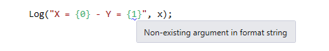

Je ne pense pas qu’il soit vraiment nécessaire de présenter [ReSharper](https://www.jetbrains.com/resharper/) (souvent abbrégé R#), mais au cas où vous ne connaitriez pas, il s’agit d’un outil créé par JetBrains qui analyse votre code C# ou VB.NET en temps réel pour vous avertir des bugs potentiels, mauvaises pratiques, non-respect des conventions, etc. Il propose aussi de nombreux refactorings et générateurs de code bien utiles. Je l’utilise depuis quelques années maintenant, et cela a beaucoup amélioré ma productivité et la qualité de mon code.

Entre autres choses, R# vous avertit sur l’utilisation incorrecte de méthodes du .NET Framework. Par exemple, si vous appelez `Path.GetFullPath` avec un chemin qui est peut-être null, il affiche un avertissement :


Comment R# sait-il que `Path.GetFullPath` n’accepte pas d’argument null ? Et d’ailleurs, comment sait-il que `Console.ReadLine` peut renvoyer null ? Je suppose que ça aurait pu être codé en dur dans l’outil, mais ce ce ne serait pas une approche très élégante, et ne permettrait pas l’extensibilité… En fait, ReSharper utilise des [annotations externes](https://www.jetbrains.com/resharper/webhelp80/Code_Analysis__External_Annotations.html). Ce sont des fichiers XML qui sont fournis avec R# et contiennent des métadonnées à propos des classes et méthodes du .NET Framework. Ces données sont utilisées par l’analyseur pour détecter les problèmes potentiels dans votre code.

Soit, mais alors qu’en est-il des bibliothèques tierces ? Evidemment, JetBrains ne peut pas créer les annotations pour celles-ci, il y en a trop. La bonne nouvelle, c’est que vous pouvez écrire vos propres fichiers d’annotations externes pour les bibliothèques que vous utilisez, ou pour votre propre code. Cependant, pour votre code, il y a un moyen beaucoup plus pratique : vous pouvez appliquer les annotations directement dans votre code à l’aide d’attributs. Il y a deux moyens d’obtenir ces attributs :

- Référencer l’assembly où ils sont définis (JetBrains.Annotations.dll dans le répertoire d’installation de R#). C’est très bien si ça ne vous gêne pas d’avoir une référence vers quelque chose qui n’a rien à voir avec votre application, mais ce n’est probablement pas une bonne idée pour une librairie.
- Déclarer les attributs dans votre propre code. En fait, il n’est pas nécessaire de les écrire soi-même, car R# a une option pour copier leur implémentation dans le presse-papier, comme illustré ci-dessous. Il suffit ensuite de les coller dans un fichier de code du projet.


Maintenant qu’on a les attributs, comment les utilise-t-on ? Je vais présenter quelques unes des annotations les plus fréquemment utilisées.

### NotNull

Cette annotation indique que l’élément sur lequel il est appliqué ne peut pas, ou ne doit pas, être null.

Si elle est appliquée sur une méthode ou propriété, cela signifie que celle-ci ne renverra jamais null:

```
[NotNull]
public string GetString()
{
    return "Hello world!";
}
```

Quand une méthode a cet attribut, si vous testez que la valeur de retour est null (ou non null), R# vous avertira que la condition est toujours fausse (ou vraie) :


Si l’annotation est appliquée à un paramètre de méthode, cela signifie que null n’est pas une valeur d’argument valide :

```
public string Repeat([NotNull] string s)
{
    if (s == null)
        throw new ArgumentNullException("s");
    return s + s;
}
```

Si R# détermine que la valeur passée pour `s` peut être null, il vous en avertira, comme illustré dans le premier exemple de cet article.

Cette annotation peut être ajoutée automatiquement en utilisant le menu  “quick fix” de ReSharper. L’option “Not null” va juste ajouter l’annotation; l’option “Check parameter for null” va ajouter l’annotation ainsi qu’une vérification de la valeur:


### 


### CanBeNull

C’est le contraire de `NotNull`. Appliquée à une méthode ou propriété, cette annotation signifie que cette méthode ou propriété peut renvoyer une valeur null. Appliquée à un paramètre, elle signifie que null est une valeur d’argument valide.

### Pure

Celle-ci est très utile. Appliquée à une méthode, elle signifie que la méthode est [pure](http://fr.wikipedia.org/wiki/Fonction_pure). Une méthode pure n’a pas d’effet de bord observable, donc si vous n’utilisez pas la valeur renvoyée par la méthode, l’appel n’a aucun effet utile, c’est donc probablement une erreur. Exemple typique avec `String.Replace`:


###  

### StringFormatMethod

Cette annotation indique qu’une méthode fonctionne sur le même principe que la méthode `String.Format`, c’est-à-dire qu’elle prend une chaine de format composite, suivie d’un nombre variable d’arguments qui remplaceront les “trous” dans la chaine de format.

```
[StringFormatMethod("format")]
public static void Log(string format, params object[] args)
{
    ...
}
```

Cela permet à R# de vous avertir si les trous et les arguments ne correspondent pas :



### UsedImplicitly

Celle-ci indique à ReSharper qu’un élément de code est utilisé, même si R# ne peut pas le détecter statiquement. Cela a pour effet d’inhiber l’avertissement qui dit qu’un élément n’est pas utilisé. Cela est utile, par exemple, quand un type ou membre est utilisé uniquement via la réflexion.

### NoEnumeration

Cette annotation est appliquée à un paramètre `IEnumerable`, et signifie que la méthode n’énumèrera pas la séquence. R# donne un avertissement quand un `IEnumerable` est énuméré plusieurs fois, donc utiliser cet attribut permet d’éviter les faux positifs pour cet avertissement :

```
public static IEnumerable<T> EmptyIfNull<T>([NoEnumeration] this IEnumerable<T> source)
{
    return source ?? Enumerable.Empty<T>();
}
```

### InstantHandle

Celle-ci s’applique à un paramètre de type delegate, et signifie que le delegate sera exécuté uniquement pendant l’exécution de la méthode. Cela permet d’empêcher l’avertissement *“Access to modified closure”,* qui apparait quand une expression lambda capture une variable qui est modifiée ultérieurement.

### ContractAnnotation

Cette annotation est un moyen puissant de décrire les dépendances entre les entrées et la sortie d’une méthode. Cela permet à R# de prédire la façon dont une méthode se comportera. Par exemple, cette méthode renverra null si son argument est null, et non null sinon :

```
[ContractAnnotation("null => null; notnull => notnull")]
public object Transform(object data)
{
    ...
}
```

Grâce à cette annotation, ReSharper saura que si l’argument était non null, le résultat ne sera pas null non plus.

La méthode suivante ne se termine pas normalement (elle lance une exception) si son argument est null:

```
[ContractAnnotation("value:null => halt")]
public static void CheckArgumentNull<T>(
    [NoEnumeration] this T value,
    [InvokerParameterName] string paramName)
    where T : class
{
    if (value == null)
        throw new ArgumentNullException(paramName);
}
```

Cela permet à R# de savoir que si vous passez null à cette méthode, le code qui suit l’appel ne sera jamais atteint; s’il est atteint, on peut supposer que la valeur n’est pas null.

### LocalizationRequired

Cette annotation signifie qu’une propriété ou un paramètre de méthode devrait être localisé; si vous passez une valeur codée en dur, R# vous avertira et suggèrera de l’extraire vers un fichier de ressource.


## Conclusion

Maintenant, vous vous demandez peut-être “mais pourquoi est-ce que je me donnerais tant de mal pour ajouter toutes ces annotations à mon code?”. La raison est simple : cela aide ReSharper à vous aider ! En lui donnant plus d’informations sur votre code, vous permettez à R# de vous donner des recommandations plus pertinentes et de produire moins de faux positifs. De plus, si vous être un auteur de bibliothèque, cela améliore l’utilisation de votre bibliothèque pour les utilisateurs de ReSharper. J’utilise beaucoup les annotations R# dans ma bibliothèque [Linq.Extras](https://github.com/thomaslevesque/Linq.Extras), c’est donc un bon endroit pour trouver d’autres exemples.

Remarquez que je n’ai décrit qu’une petite partie des annotations disponibles. Il y en a beaucoup d’autres, principalement destinées à des scénarios spécifiques à ASP.NET. Vous pouvez les voir dans le fichier d’annotations généré par ReSharper, ou dans la [documentation](https://www.jetbrains.com/resharper/webhelp80/Reference__Code_Annotation_Attributes.html) (qui n’est pas tout à fait complète, mais quand même utile).

