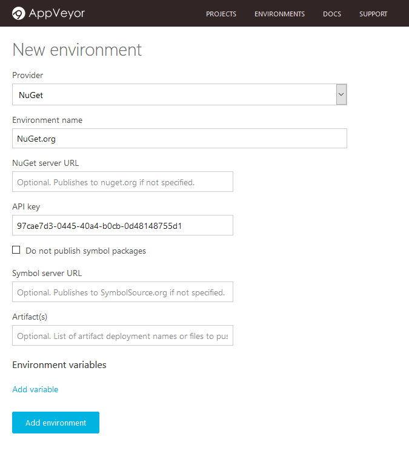
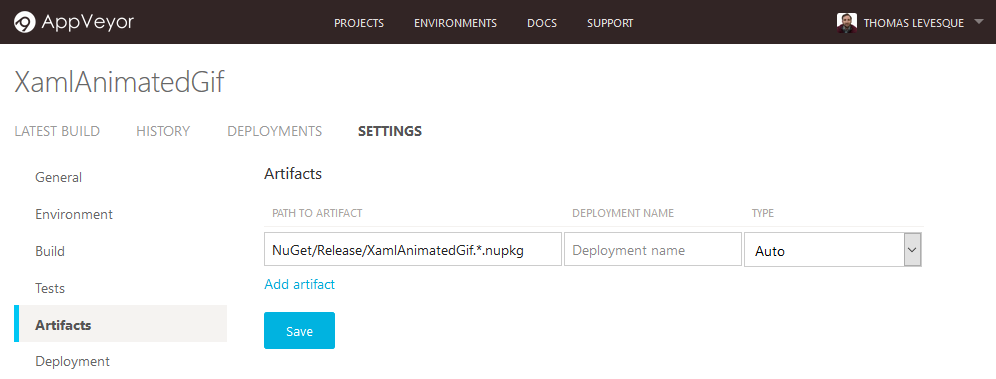
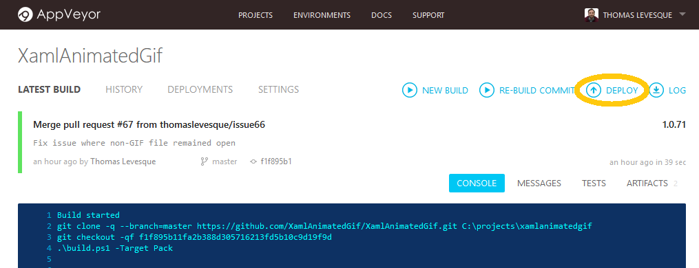
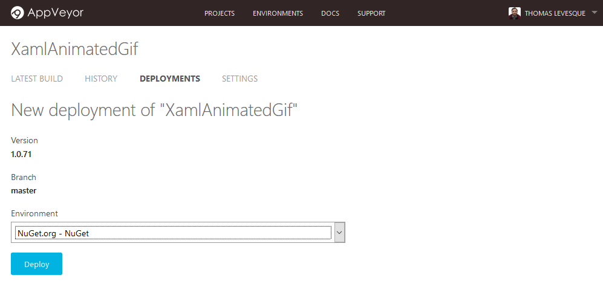
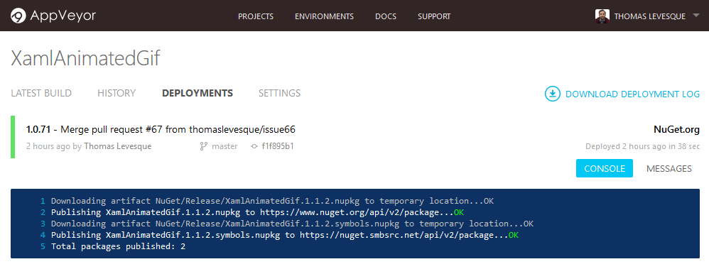

Depuis quelques mois, j’utilise [AppVeyor CI](https://ci.appveyor.com/) pour certains de mes projets open-source (avec [Cake](http://cakebuild.net/) pour les scripts de build). J’en suis très content, mais il y avait un point qui m’ennuyait : je ne trouvais pas comment publier des packages sur NuGet.org directement depuis AppVeyor. Il fallait que je télécharge le package en local, puis que je l’uploade manuellement depuis ma machine (soit avec `nuget push` en ligne de commande, soit via le formulaire web sur NuGet.org), ce qui augmente considérablement les risques de mauvaise manipulation.

La solution s’est avérée assez simple en fin de compte, une fois que j’ai su où chercher. Je vais en décrire ici les étapes.

### Configuration initiale

**1. Configurer NuGet.org comme environnement de déploiement**

Avant de pouvoir pousser des packages vers la galerie NuGet, il faut configurer NuGet.org comme environnement de déploiement (c’est une opération à faire une seule fois, à moins de vouloir publier des packages sous différentes identités).

Une fois connecté sur AppVeyor, allez sur la page *Environments*, cliquez sur *New Environment*, et sélectionnez *NuGet* comme fournisseur de déploiement :

Choisissez un nom pour l’environnement (par exemple NuGet.org), et saisissez votre clé d’API (non, ce n’est pas ma vraie clé sur la copie d’écran…). Vous pouvez trouver votre clé d’API NuGet sur votre page de compte quand vous êtes connecté sur NuGet.org. Laissez l’URL vide si vous voulez poussez sur la galerie NuGet officielle. Quand vous avez terminé, cliquez sur *Add Environment*.

**2. Configurer les artéfacts dans votre projet**

Dans les paramètres de votre projet, assurez-vous que les packages NuGet générés par votre processus de build sont configurés comme des artéfacts. Il suffit pour cela d’ajouter le chemin vers les fichiers .nupkg (le nom de déploiement est optionnel) :

C’est tout ! Vous êtes maintenant prêt à publier.

### Publier des packages

Lancez une nouvelle build, et quand il est terminé, cliquez sur le bouton *Deploy* pour cette build :

Sélectionnez NuGet.org comme environnement de déploiement :

Cliquez sur *Deploy*, et laissez la magie opérer. Si tout se passe bien, vous devriez voir quelque chose comme ça :

Félicitations, votre package est maintenant sur la galerie NuGet. Si si, vous pouvez allez vérifier !

