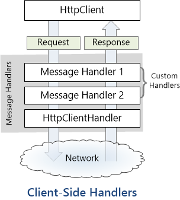

Il y a quelques années, Microsoft a introduit la classe `HttpClient` comme alternative moderne à `HttpWebRequest` pour faire des requêtes web depuis des applications .NET. Non seulement cette nouvelle API est beaucoup plus facile à utiliser, plus propre, et asynchrone, mais elle est aussi facilement extensible.

Vous avez peut-être remarqué que `HttpClient` a un constructeur qui accepte un `HttpMessageHandler`. De quoi s'agit-il ? Un `HttpMessageHandler` est un objet qui accepte une requête (`HttpRequestMessage`) et renvoie une réponse (`HttpResponseMessage`) ; la façon dont il le fait dépend complètement de l'implémentation. Par défaut, `HttpClient` utilise `HttpClientHandler`, un handler qui envoie une requête vers un serveur sur le réseau et renvoie la réponse du serveur. L'autre implémentation fournie de `HttpMessageHandler` est une classe abstraite nommée `DelegatingHandler`, et c'est de celle là que je voudrais parler.

## Le pipeline

`DelegatingHandler` est un handler qui est conçu pour être chaîné à un autre handler, ce qui donne un pipeline à travers lequel les requêtes et réponses vont passer, comme illustré par ce schéma :

(Image tirée du [site officiel ASP.NET](https://www.asp.net/web-api/overview/advanced/httpclient-message-handlers))

Chaque handler a la possibilité d'examiner et/ou de modifier la requête avant de la passer au handler suivant, et d'examiner et/ou de modifier la réponse reçue du handler suivant. Habituellement, le dernier handler dans le pipeline est le `HttpClientHandler`, qui communique directement avec le réseau.

La chaîne de handlers peut être configurée comme ceci :

```csharp
var pipeline = new MyHandler1()
{
    InnerHandler = new MyHandler2()
    {
        InnerHandler = new HttpClientHandler()
    }
};
var client = new HttpClient(pipeline);
```

Mais si vous préférez les interfaces "fluent", il est facile de créer une méthode d'extension qui permet de le faire comme ceci :

```csharp
var pipeline = new HttpClientHandler()
    .DecorateWith(new MyHandler2())
    .DecorateWith(new MyHandler1());
var client = new HttpClient(pipeline);
```

Tout ça semble peut-être un peu abstrait pour l'instant, mais cette architecture à base de pipeline rend possible plein de scénarios intéressants. En effet, ces handlers de messages HTTP peuvent être utilisés pour ajouter des comportements personnalisés au traitement des requêtes et réponses. Je vais en donner quelques exemples.

**Remarque :** Je présente cette fonctionnalité d'un point de vue client (vu que je développe essentiellement des applis clientes), mais le même système de handlers est également utilisé [côté serveur dans ASP.NET Web API](https://www.asp.net/web-api/overview/advanced/http-message-handlers).

## Tests unitaires

Le premier cas d'utilisation qui vient à l'esprit, et le premier que j'ai mis en oeuvre, c'est les tests unitaires. Si vous testez une classe qui fait des paiements en ligne via HTTP, vous ne voulez pas que vos tests envoient réellement des requêtes au vrai serveur... Vous voulez juste vous assurer que les requêtes envoyées sont correctes, et que le code réagit correctement à des réponses spécifiques. Une solution simple à ce problème est de créer un handler "stub", et de l'injecter dans votre classe à la place de `HttpClientHandler`. Voici une implémentation possible :

```csharp
class StubHandler : HttpMessageHandler
{
    // Responses to return
    private readonly Queue<HttpResponseMessage> _responses =
        new Queue<System.Net.Http.HttpResponseMessage>();

    // Requests that were sent via the handler
    private readonly List<HttpRequestMessage> _requests =
        new List<System.Net.Http.HttpRequestMessage>();

    protected override Task<HttpResponseMessage> SendAsync(
        HttpRequestMessage request,
        CancellationToken cancellationToken)
    {
        if (_responses.Count == 0)
            throw new InvalidOperationException("No response configured");

        _requests.Add(request);
        var response = _responses.Dequeue();
        return Task.FromResult(response);
    }

    public void QueueResponse(HttpResponseMessage response) =>
        _responses.Enqueue(response);

    public IEnumerable<HttpRequestMessage> GetRequests() =>
        _requests;
}
```

Cette classe permet d'enregister les requêtes qui sont envoyées via le handler et de spécifier les réponses qui doivent être renvoyées. Par exemple, on pourrait écrire un test comme celui-ci :

```csharp
// Arrange
var handler = new StubHandler();
handler.EnqueueResponse(new HttpResponseMessage(HttpStatusCode.Unauthorized));
var processor = new PaymentProcessor(handler);

// Act
var paymentResult = await processor.ProcessPayment(new Payment());

// Assert
Assert.AreEqual(PaymentStatus.Failed, paymentResult.Status);
```

Bien sûr, plutôt que de créer un stub manuellement, il est possible d'utiliser un framework de mock pour générer un faux handler. Le fait que la méthode `SendAsync` soit protégée rend cette approche un peu moins facile qu'elle devrait l'être, mais on peut facilement contourner le problème en créant une classe dérivée qui expose une méthode publique virtuelle, et en faisant un mock de cette classe :

```csharp
public abstract class MockableMessageHandler : HttpMessageHandler
{
    protected override sealed Task<HttpResponseMessage> SendAsync(
        HttpRequestMessage request,
        CancellationToken cancellationToken)
    {
        return DoSendAsync(request);
    }

    public abstract Task<HttpResponseMessage> DoSendAsync(HttpRequestMessage request);
}
```

Exemple d'utilisation avec [FakeItEasy](https://github.com/FakeItEasy/FakeItEasy) :

```csharp
// Arrange
var handler = A.Fake<MockableMessageHandler>();
A.CallTo(() => handler.DoSendAsync(A<HttpRequestMessage>._))
    .Returns(new HttpResponseMessage(HttpStatusCode.Unauthorized));
var processor = new PaymentProcessor(handler);
...
```

## Logging

Écrire dans  le log les requêtes envoyées et les réponses reçues peut aider à diagnostiquer certains problèmes. C'est très facile à mettre en oeuvre avec un un `DelegatingHandler` personnalisé :

```csharp
public class LoggingHandler : DelegatingHandler
{
    private readonly ILogger _logger;

    public LoggingHandler(ILogger logger)
    {
        _logger = logger;
    }

    protected override async Task<HttpResponseMessage> SendAsync(
        HttpRequestMessage request,
        CancellationToken cancellationToken)
    {
        _logger.Trace($"Request: {request}");
        try
        {
            // base.SendAsync calls the inner handler
            var response = await base.SendAsync(request, cancellationToken);
            _logger.Trace($"Response: {response}");
            return response;
        }
        catch (Exception ex)
        {
            _logger.Error($"Failed to get response: {ex}");
            throw;
        }
    }
}
```

## Réessayer les requêtes échouées

Un autre cas d'utilisation intéressant des handlers de messages HTTP est de réessayer automatiquement les requêtes qui ont échouées. Par exemple, le serveur auquel on s'adresse peut être temporairement indisponible (503), il peut limiter nos requêtes (429), ou on peut tout simplement avoir perdu l'accès à internet. Dans toutes ces situations, réessayer la même requête plus tard a de bonnes chances de fonctionner (le serveur peut avoir redémarré, on peut avoir retrouvé du wifi...). Gérer la retentative au niveau du code applicatif est laborieux, car ça peut se produire pratiquement n'importe où. Avoir cette logique au plus bas niveau possible et implémentée d'une façon complètement transparente pour l'appelant rend les choses beaucoup plus simples.

Voici une implémentation possible d'un handler qui réessaie les requêtes échouées :

```csharp
public class RetryHandler : DelegatingHandler
{
    protected override async Task<HttpResponseMessage> SendAsync(
        HttpRequestMessage request,
        CancellationToken cancellationToken)
    {
        while (true)
        {
            try
            {
                // base.SendAsync calls the inner handler
                var response = await base.SendAsync(request, cancellationToken);

                if (response.StatusCode == HttpStatusCode.ServiceUnavailable)
                {
                    // 503 Service Unavailable
                    // Wait a bit and try again later
                    await Task.Delay(5000, cancellationToken);
                    continue;
                }

                if (response.StatusCode == (HttpStatusCode)429)
                {
                    // 429 Too many requests
                    // Wait a bit and try again later
                    await Task.Delay(1000, cancellationToken);
                    continue;
                }

                // Not something we can retry, return the response as is
                return response;
            }
            catch (Exception ex) when(IsNetworkError(ex))
            {
                // Network error
                // Wait a bit and try again later
                await Task.Delay(2000, cancellationToken);
                continue;
            }
        }
    }

    private static bool IsNetworkError(Exception ex)
    {
        // Check if it's a network error
        if (ex is SocketException)
            return true;
        if (ex.InnerException != null)
            return IsNetworkError(ex.InnerException);
        return false;
    }
}
```

Remarquez que cette implémentation est un peu simpliste ; pour l'utiliser dans du code de production, il faudra sans doute ajouter un "exponential backoff" (attendre de plus en plus longtemps entre chaque tentative), prendre en compte l'en-tête `Retry-After` pour déterminer combien de temps il faut attendre, ou encore déterminer de façon un peu plus subtile si une exception correspond à une erreur réseau. De plus, en l'état actuel, ce handler réessaiera *indéfiniment* jusqu'à ce que la requête réussisse ; assurez-vous donc de passer un jeton d'annulation (`CancellationToken`) pour pouvoir l'arrêter si besoin.

## Autres cas d'utilisations

Je ne peux pas donner d'exemples pour chaque scénario possible, mais voilà quelques autres cas d'utilisation possible des handlers de messages HTTP :

- Gestion personnalisée des cookies (quelque chose que j'ai réellement fait, pour contourner un bug dans `CookieContainer`)
- Authentification personnalisée (également quelque chose que j'ai fait, pour implémenter l'authentification OAuth2)
- Utiliser l'en-tête `X-HTTP-Method-Override` pour passer les proxy qui refusent certaines méthode HTTP (voir [l'article de Scott Hanselman](http://www.hanselman.com/blog/HTTPPUTOrDELETENotAllowedUseXHTTPMethodOverrideForYourRESTServiceWithASPNETWebAPI.aspx) pour plus de détails)
- Chiffrement ou encodage personnalisé
- Mise en cache
- ...


Comme vous le voyez, il y a tout un monde de possibilités. Si vous avez d'autres idées, indiquez les dans les commentaires !

