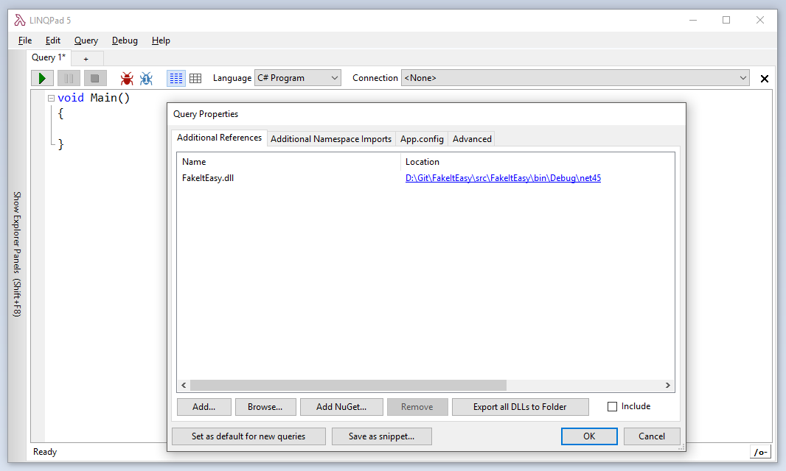
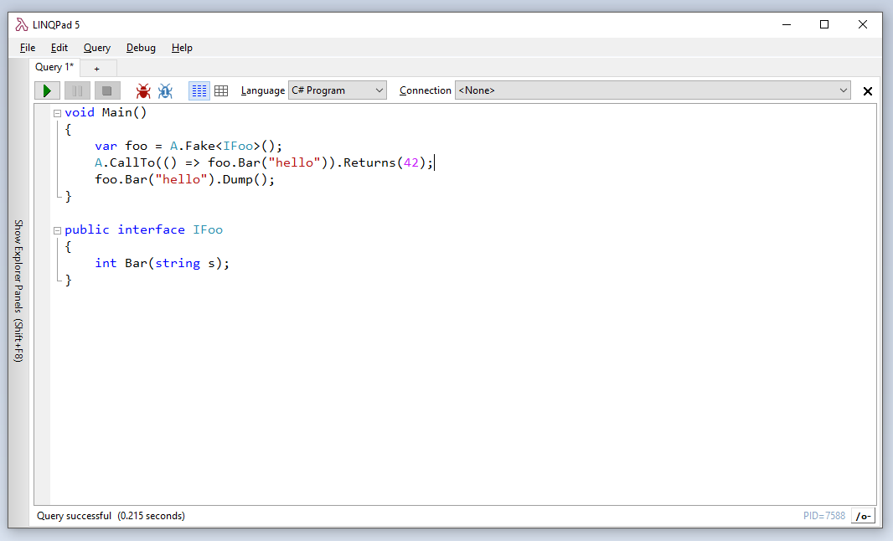
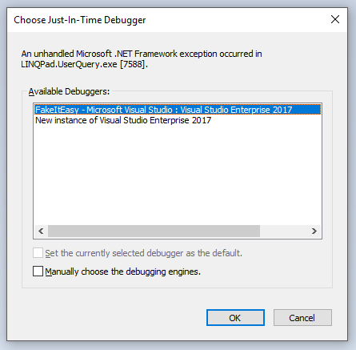
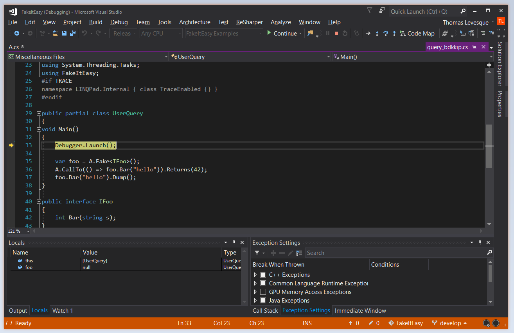

Cela faisait bien longtemps que je voulais bloguer à propos de [LINQPad](http://www.linqpad.net/). Au cas où vous ne connaissez pas, LINQPad est un outil qui permet d'écrire et de tester du code très rapidement sans avoir besoin de créer un projet complet dans Visual Studio. Il supporte C#, VB.NET, F# et SQL. Il était initialement conçu comme un outil éducatif pour expérimenter avec LINQ (son auteur, Joe Albahari, l'avait développé pour accompagner son livre *C# in a Nutshell*), mais il est aussi extrêmement utile comme outil générique pour tester du code .NET.

J'utilise fréquemment LINQPad pour tester rapidement une bibliothèque sur laquelle je travaille. C'est très facile, il suffit de référencer l'assembly à tester et de l'utiliser normalement. Mais quand la bibliothèque ne se comporte pas comme prévu, il est souvent utile de pouvoir la déboguer pas à pas... Il s'avère que c'est assez simple à faire à partir de LINQPad !

La version premium de LINQPad a un débogueur intégré, qui n'est pas aussi puissant que celui de Visual Studio, mais quand même utile pour déboguer les scripts LINQPad. Cependant, il ne permet pas de rentrer dans le code de la bibliothèque... Heureusement, il y a une astuce qui permet d'utiliser le débogueur de Visual Studio pour déboguer le script qui s'exécuter dans LINQPad.

Tout d'abord, ouvrez dans Visual Studio la bibliothèque à déboguer, si ce n'est pas déjà fait. Compilez le projet, et ajoutez une référence à l'assembly dans votre script LINQPad:



Ecrivez du code qui utilise votre bibliothèque:



Et ajoutez cette ligne au début du script LINQPad:

```csharp
Debugger.Launch();
```

Quand vous exécutez le script, un dialogue va s'affichez pour vous demander de choisir un débogueur:



Sélectionnez l'instance de Visual Studio dans laquelle votre solution est ouverte et cliquez OK. Cela va attacher le débogueur de Visual Studio au processus qui exécute le script LINQPad, et suspendre l'exécution au niveau de l'appel à `Debugger.Launch()`:



Vous pouvez maintenant déboguer votre script LINQPad *et* votre bibliothèque. Vous pouvez mettre des points d'arrêt, rentrer dans les méthodes, ajouter des espions, etc, exactement comme quand vous déboguez une application normale !

