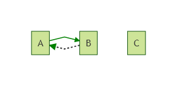

## Middlewhat?
 L'architecture d'ASP.NET Core est basée sur un système de **middlewares**, des morceaux de code qui gèrent les requêtes et réponses. Les middlewares sont chainés les uns aux autres pour constituer un **pipeline**. Les requêtes entrantes passent dans le pipeline, où chaque middleware a l'occasion de les examiner et/ou de les modifier avant des les passer au middleware suivant. Les réponses sortantes passent aussi dans le pipeline, dans l'ordre inverse. Si tout cela semble très abstrait, le schéma suivant, tiré de la [documentation officielle ASP.NET Core](https://docs.microsoft.com/en-us/aspnet/core/fundamentals/middleware), devrait aider à comprendre :    Les middlewares peuvent faire toutes sortent de choses, comme gérer l'authentification, les erreurs, les fichiers statiques, etc. La couche MVC d'ASP.NET Core est également implémentée comme un middleware. 
## Configurer le pipeline
 On configure habituellement le pipeline ASP.NET Core dans la méthode `Configure` de la classe `Startup`, en appelant des méthodes `Use*` sur le `IApplicationBuilder`. Voici un exemple tiré de la documentation :  
```csharp
public void Configure(IApplicationBuilder app)
{
    app.UseExceptionHandler("/Home/Error");
    app.UseStaticFiles();
    app.UseAuthentication();
    app.UseMvcWithDefaultRoute();
}
```
  Chaque méthode `Use*` ajoute un middleware au pipeline. L'ordre dans lequel ils sont ajoutés détermine l'ordre dans lequel les requêtes les traverseront. Dans cet exemple, une requête entrante va d'abord passer par le middleware de gestion d'exception, puis par le middleware de fichiers statiques, puis par le middleware d'authentification, et sera finalement gérée par le middleware MVC.  Les méthodes `Use*` dans cet exemple sont en fait juste des raccourcis pour faciliter la construction du pipeline. Sous le capot, elles finissent toutes par appeler, directement ou indirectement, les primitives de bas niveau suivantes : `Use` et `Run`. Ces deux méthodes ajoutent un middleware au pipeline, la différence est que `Run` ajoute un middleware *terminal*, c'est à dire qui est le dernier du pipeline. 
## Un pipeline basique sans branches
 Regardons d'abord un exemple simple, qui utilise simplement les primitives `Use` et `Run` :  
```csharp
public void Configure(IApplicationBuilder app)
{
    // Middleware A
    app.Use(async (context, next) =>
    {
        Console.WriteLine("A (before)");
        await next();
        Console.WriteLine("A (after)");
    });

    // Middleware B
    app.Use(async (context, next) =>
    {
        Console.WriteLine("B (before)");
        await next();
        Console.WriteLine("B (after)");
    });

    // Middleware C (terminal)
    app.Run(async context =>
    {
        Console.WriteLine("C");
        await context.Response.WriteAsync("Hello world");
    });
}
```
  Ici, les middleware sont définis "inline" avec des méthodes anonymes ; ils pourraient aussi être définis commes des classes complètes, mais pour cet exemple j'ai opté pour la forme la plus concise. Les middleware non-terminaux prennent deux arguments : le `HttpContext` et un delegate qui appelle le middleware suivant. Le middleware terminal prend seulement le `HttpContext`. Ici on a deux middlewares non-terminaux A et B qui écrivent simplement dans la console, et un middleware terminal C qui écrit la réponse.  Voici la sortie console quand on envoie une requête à l'application :  
```text
A (before)
B (before)
C
B (after)
A (after)
```
  On voit que chaque middleware est traversé dans l'ordre dans lequel il a été ajouté, puis traversé à nouveau en sens inverse. Le pipeline peut être représenté comme suit :  
## Court-circuiter le pipeline
 Un middleware n'est pas obligé d'appeler le middleware suivant. Par exemple, si le middleware de fichiers statiques peut gérer une requête, il n'a pas besoin de la passer au reste du pipeline, il peut répondre immédiatement. Ce comportement s'appelle "court-circuiter le pipeline".  Dans l'exemple précédent, si on commente l'appel à `next()` dans le middleware B, on obtient la sortie suivante :  
```text
A (before)
B (before)
B (after)
A (after)
```
  Comme vous pouvez le voir, le middleware C n'est jamais appelé. Le pipeline ressemble maintenant à ceci :  
## Faire des branches dans le pipeline
 Dans les exemples précédents, il y avait une seule "branche" dans le pipeline : le middleware qui suivait A était toujours B, et le middleware qui suivait B était toujours C. Mais rien n'impose que ça se passe comme ça ; on peut aussi faire qu'une requête donnée soit traitée par un autre pipeline, en fonction du chemin ou de tout autre critère.  Il y a deux types de branches : celles qui rejoignent le pipeline principal, et celles qui s'en séparent définitivement. 
### Faire une branche entièrement séparée
 On peut faire cela à l'aide de la méthode `Map` ou `MapWhen`. `Map` permet de spécifier une branche en fonction du chemin de la requête. `MapWhen` donne un contrôle plus fin : on peut spécifier un prédicat pour décider de passer ou non sur la branche. Prenons un exemple simple avec `Map` :  
```csharp
public void Configure(IApplicationBuilder app)
{
    app.Use(async (context, next) =>
    {
        Console.WriteLine("A (before)");
        await next();
        Console.WriteLine("A (after)");
    });

    app.Map(
        new PathString("/foo"),
        a => a.Use(async (context, next) =>
        {
            Console.WriteLine("B (before)");
            await next();
            Console.WriteLine("B (after)");
        }));

    app.Run(async context =>
    {
        Console.WriteLine("C");
        await context.Response.WriteAsync("Hello world");
    });
}
```
  Le premier argument de `Map` est un `PathString` qui représente le préfixe du chemin de la requête. Le second argument est un delegate qui configure le pipeline pour la branche (le paramètre `a` représente le `IApplicationBuilder` pour la branche). La branche définie par le delegate traitera la requête si son chemin commence par le préfixe spécifié.  Pour une requête qui ne commence pas par `/foo`, ce code produit la sortie suivante :  
```text
A (before)
C
A (after)
```
  Le middleware B n'est pas appelé, puisqu'il est dans la branche, et que la requête ne correspond pas au préfixe pour la branche. Mais pour une requête dont le chemin commence par `/foo`, la sortie est la suivante :  
```text
A (before)
B (before)
B (after)
A (after)
```
  Remarquez que cette requête renvoie une erreur 404 (Not found) : c'est parce que le middleware B appelle `next()`, mais il n'y a pas de middleware suivant ; dans ce cas le comportement par défaut est de renvoyer une erreur 404. Pour régler ça, on pourrait utiliser `Run` au lieu de `Use`, ou alors ne pas appeler `next()`.  Le pipeline défini par ce code peut être représenté comme suit :    (Pour plus de clarté, j'ai omis les flèches des réponses)  Comme vous pouvez le voir, la branche où se trouve le middleware B ne rejoint pas le pipeline principal, le middleware C n'est donc pas appelé. 
### Faire une branche qui rejoint le pipeline principal
 On peut créer une branche qui rejoint le pipeline principal à l'aide de la méthode `UseWhen`. Cette méthode accepte un prédicat sur le `HttpContext` pour décider de passer ou non sur la branche. À la fin de son exécution, cette branche rejoindra le pipeline principal là où elle l'a quitté. Voici un exemple similaire au précédent, mais avec une branche qui rejoint le pipeline principal :  
```csharp
public void Configure(IApplicationBuilder app)
{
    app.Use(async (context, next) =>
    {
        Console.WriteLine("A (before)");
        await next();
        Console.WriteLine("A (after)");
    });

    app.UseWhen(
        context => context.Request.Path.StartsWithSegments(new PathString("/foo")),
        a => a.Use(async (context, next) =>
        {
            Console.WriteLine("B (before)");
            await next();
            Console.WriteLine("B (after)");
        }));

    app.Run(async context =>
    {
        Console.WriteLine("C");
        await context.Response.WriteAsync("Hello world");
    });
}
```
  Pour une requête dont le chemin ne commence pas par `/foo`, ce code produit la même sortie que l'exemple précédent :  
```text
A (before)
C
A (after)
```
  Là encore, le middleware B n'est pas appelé, puisque la requête ne correspond pas au prédicat de la branche. Mais pour une requête dont le chemin commence par `/foo`, on obtient la sortie suivante :  
```text
A (before)
B (before)
C
B (after)
A (after)
```
  Comme on peut le voir, la requête passe par la branche (middleware B), puis revient sur le pipeline principal, en finissant par le middleware C. Le pipeline peut donc être représenté comme suit :    Remarquez qu'il n'y a pas de méthode `Use` qui accepte un `PathString` pour spécifier le préfixe du chemin. Je ne sais pas pourquoi cette méthode n'est pas incluse, mais il est facile de l'écrire à l'aide de `UseWhen` :  
```csharp
public static IApplicationBuilder Use(this IApplicationBuilder builder, PathString pathMatch, Action<IApplicationBuilder> configuration)
{
    return builder.UseWhen(
        context => context.Request.Path.StartsWithSegments(pathMatch),
        configuration);
}
```

## Conclusion
 Comme vous pouvez le voir, le principe du pipeline de middlewares est assez simple, mais très puissant. La plupart des fonctionnalités standard d'ASP.NET Core (authentification, fichiers statiques, mise en cache, MVC, etc) sont implémentées comme des middlewares. Et bien sûr, il est très simple de créer son propre middleware !

